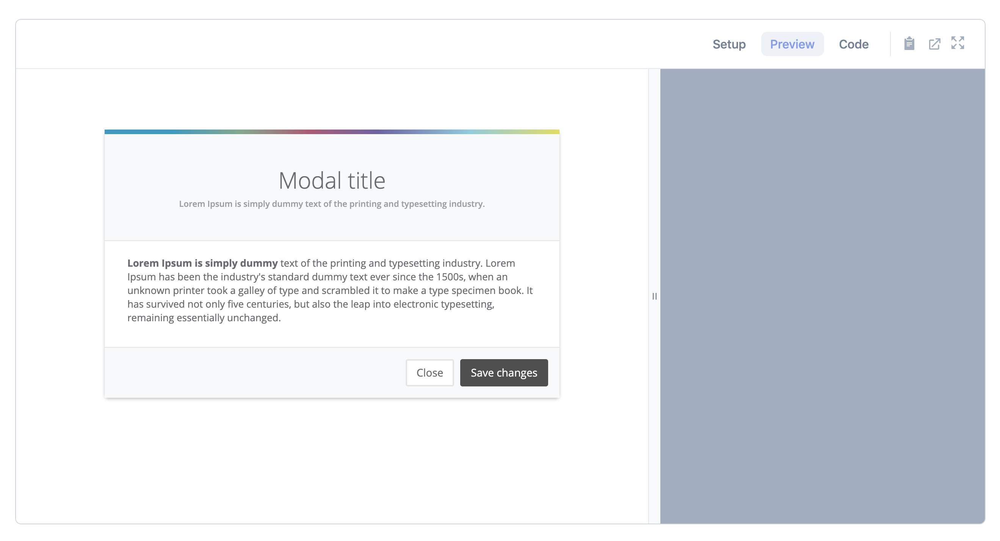

# preview-box 



Preview box is a recreation of [Adam Wathan's](https://twitter.com/adamwathan) and [Steve Schoger's](https://twitter.com/steveschoger) previewer which has recently been used on their upcoming project, [Tailwind UI](https://www.tailwindui.com/).
We have also added an extra tab for setup and a full screen mode.

## Usage

```
npm i preview-box
```

In your js file add the component to your vue instance;

```javascript
import PreviewBox from 'preview-box/src/components/PreviewBoxComponent';
window.Vue = require('vue');

if(document.getElementById('example')) {
    new Vue({
        components: {
            'preview-box': PreviewBox
        },
        el: '#example',
    });
}
```

In you HTML or template use the following setup;

```html
<div id="example">
    <!-- Other properties are :title and :language -->
    <preview-box :min-screen-size="380" :iframe-src="'/card.html'">
        <template v-slot:setup>
            <!-- Some setup text -->
        </template>
        <template v-slot:copy-setup>
            <!-- When on the setup screen, click the copy button and this data will be copied to the clipboard -->
        </template>
        <template v-slot:code-snippet>
            <!-- This code is to be in a raw entity format for syntax highlighting -->
        </template>
        <template v-slot:copy-code-snippet>
            <!-- When on the any other screen, click the copy button and this data will be copied to the clipboard -->
        </template>
    </preview-box>
</div>
```

## Project setup
```
npm install
```

### Compiles and hot-reloads for development
```
npm run serve
```

### Compiles and minifies for production
```
npm run build
```

### Lints and fixes files
```
npm run lint
```

### Customize configuration
See [Configuration Reference](https://cli.vuejs.org/config/).
